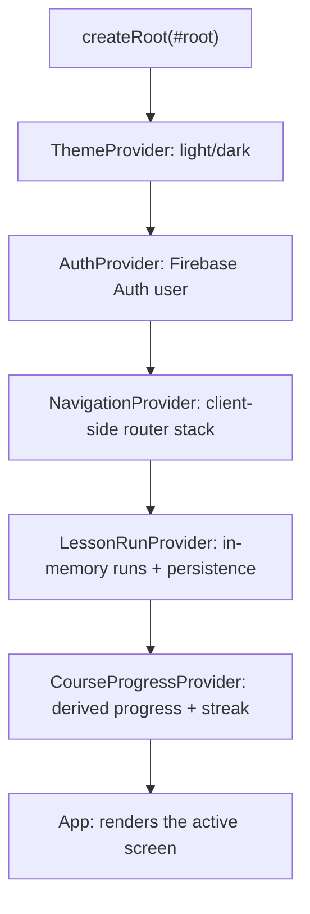
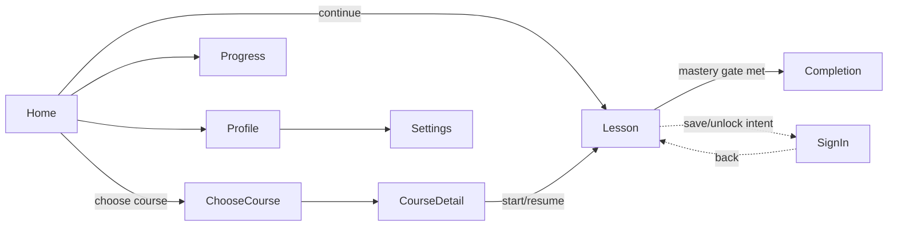
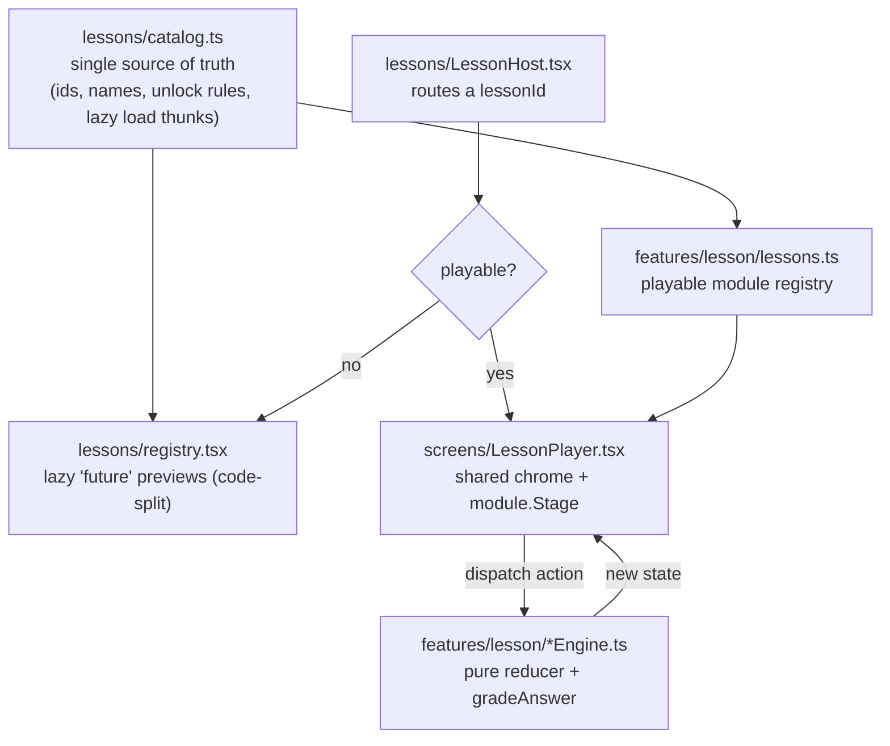
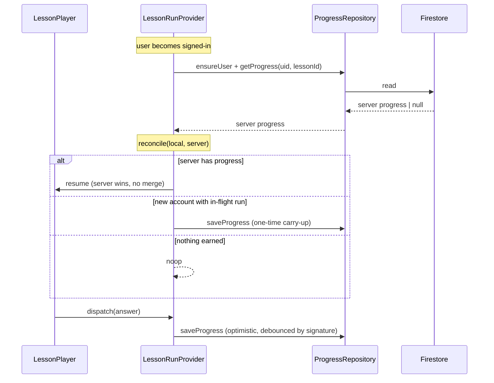

# Willow: Architecture & Codebase Flow

> Orientation map for the repo: how a learner's tap travels from the UI down to a
> pure engine and back up through persistence. This is the *flow* doc, for the
> shared vocabulary see [`CONTEXT.md`](../CONTEXT.md).

## What Willow is

A mobile-first, **deterministic, no-AI** "learn data structures by doing" web app.
The same state always yields the same feedback. All grading is pure functions, no
model calls. You can play signed-out (a transient in-memory **run**); signing in
saves a thin durable **progress** slice.

## The optional AI layer (Poly)

The deterministic core never calls a model. Phase 2 layers an *optional* Poly
tutor on top through Firebase callable functions, the single AI seam, keeping the
OpenAI key in a server-side secret. Poly scores a learner's typed self-explanation
at each concept teach-back (the text loop) and gives action-grounded hints; every
call is non-gating and falls back to the deterministic lesson on any failure.

- **Poly voice (Chunk 5):** two more callables, `polySpeak` (OpenAI TTS, returns
  base64 mp3) and `polyTranscribe` (OpenAI STT from base64 audio), let Poly speak
  its teach-back questions and accept spoken answers. The transcript feeds the
  same scorer as typed text; the OpenAI key stays server-side (same secret). All
  voice paths fall back to the text loop on any failure.
- **Live voice (Realtime):** the teach-back is a spoken conversation. Poly speaks
  the question, then the mic opens and the learner's words stream in live. The
  browser connects straight to OpenAI over WebRTC for streaming transcription
  using a short-lived token minted by `polyRealtimeToken` (the real key never
  reaches the client); the rolling transcript feeds the same scorer. Typing stays
  available as a pull-up keyboard sheet, and any failure (no token, mic denied,
  connection error) falls back to it.

### Hints: the boundary-condition cache seam

Complex-segment hints are all-AI behind the same callable seam, with a server-side
cache enabled **only** for boundary-condition edge cases. The client `diagnose()`
for a complex mechanic emits a giveaway-free `ErrorShape` (`kind` + step) plus a
`boundary` flag and a short structural `configKey` (for example `full-block` or
`head-insert`); these ride along on the hint request and never contain answer
items. The `polyHint` callable branches on `boundary`: boundary cases are
cache-first (look up by a deterministic, sanitized key, otherwise generate,
giveaway-verify, then store), while interior mistakes generate live and never
touch the cache. A cheap phrasing layer varies wording by attempt with no extra
model call, and a finite boundary set is precomputed offline into the same store.
Any failure falls back to the static authored hint, so hints stay non-gating.

The `hintCache` Firestore collection is **server-only**: it is read and written
through the admin SDK (which bypasses security rules), and no client rule is added,
so default-deny keeps it unreadable from the browser. The public callable persists
only keys on an authored boundary allowlist, so a hostile caller cannot poison or
grow the shared cache.

## Tech stack

| Concern        | Choice                                                            |
| -------------- | ----------------------------------------------------------------- |
| UI             | React 19, TypeScript, Vite 8                                      |
| Styling        | Tailwind CSS v4 (`@tailwindcss/vite`), Radix UI, shadcn primitives |
| Animation/viz  | `motion`, `gsap`, `@xyflow/react`, `d3-force`, `d3-hierarchy`     |
| Backend        | Firebase Auth + Cloud Firestore (emulator-first in dev)          |
| Tests          | Vitest (unit), Firebase emulator (integration), Playwright (e2e) |
| Path alias     | `@/*` → `src/*` (see `vite.config.ts`)                            |

## The big idea: three layers

```
┌──────────────────────────────────────────────────────────────┐
│  RENDERER (shallow)   screens/ · components/willow · features/hero │  React, animation
├──────────────────────────────────────────────────────────────┤
│  ENGINE (deep, pure)  features/lesson/*Engine.ts · engine.ts      │  no React/Firebase/anim
├──────────────────────────────────────────────────────────────┤
│  PERSISTENCE (seam)   features/progress/ProgressRepository        │  Firestore | in-memory
└──────────────────────────────────────────────────────────────┘
```

- **Engine** is the deep, pure core: a `(state, action) → state` reducer plus
  selectors. No React, Firebase, or animation deps, so it is fully testable and is
  the project's primary **test surface**.
- **Renderer** is shallow presentation over engine state: it animates snapshots
  and holds no rule logic.
- **Persistence boundary** (`ProgressRepository`) is the only seam the app
  reads/writes progress through. Never Firestore directly. There are two adapters:
  a Firestore one for the app and an in-memory one for tests.

## Runtime composition (the provider stack)

`src/main.tsx` nests the global context providers; everything below reads from them.



Why this order matters: `LessonRunProvider` sits **above** the screen router, so an
in-flight run survives a detour to the Sign-In screen (that's what makes anonymous
"carry-up" on sign-in possible).

## Screen flow (the router)

There is no router dependency. `src/lib/navigation.tsx` is a tiny **stack-based
router**: `Screen` is a discriminated union, `navigate`/`replace`/`back` push and
pop a stack, and `App.tsx` switches on `screen.name`.



`AppShell` wraps every screen and shows the bottom nav only on the top-level tabs
(`home`, `courses`, `course`, `progress`, `profile`, `settings`).

## The lesson plug-in architecture

A lesson is a self-contained **module** behind one interface
(`features/lesson/lessonModule.ts`): `create`, `reducer`, `toProgress`, `resume`,
`hasProgress`, selectors, and a presentational `Stage`. The shared chrome stays
lesson-agnostic, so **adding a lesson is one catalog entry plus one module**: never
a change to the seam.



- **`catalog.ts`**: the static list of courses/lessons and all the *derived*
  helpers (`isLessonUnlocked`, `derivePathNodes`, `deriveCourseProgress`,
  `currentLessonId`). Progress-dependent state is always derived from real
  `LessonProgress`, never stored on the catalog.
- **`registry.tsx`**: turns every lesson with a `load` thunk into a `React.lazy`
  chunk so heavy libs (`@xyflow/react`, `d3-*`, `gsap`) stay out of the main bundle.
- **`features/lesson/lessons.ts`**: maps each *playable* lesson id to its
  `LessonModule` (currently Stacks & Queues, Arrays, Linked Lists).
- **`engine.ts`**, the shared engine core: `LessonAction`/`LessonProgress` shapes,
  the feedback machine, and `gradeAnswer` (the on-fire combo + mastery counters)
  reused by every lesson engine.

### Where a lesson's code lives

| Piece            | Location                                     |
| ---------------- | -------------------------------------------- |
| Pure engine      | `src/features/lesson/<name>Engine.ts`        |
| Module + `Stage` | `src/lessons/<name>.tsx` (+ `src/lessons/<name>/`) |
| Catalog entry    | `src/lessons/catalog.ts`                      |
| Playable wiring  | `src/features/lesson/lessons.ts`             |

## Run vs. progress & the reconcile flow

Two shapes, one boundary (see `CONTEXT.md` for the full definitions):

- **Run** (`LessonState`): the transient, full in-memory lesson. Lives while you
  play; a refresh wipes an anonymous run.
- **Progress** (`LessonProgress`): the thin durable slice saved per signed-in user.

`LessonRunProvider` keeps one run per lesson id and persists durable changes
optimistically (off the hot path). On sign-in it **reconciles** local run vs.
server progress through the pure `reconcile` decision:



`CourseProgressProvider` then overlays the live run on top of the server snapshot so
the Home dashboard, course path, and Progress tab always show honest, derived
numbers: including for anonymous runs that never persist.

## Repository map

| Path                          | Responsibility                                             |
| ----------------------------- | --------------------------------------------------------- |
| `src/screens/`                | Full-screen views (Home, Lesson player, Completion, …)    |
| `src/lessons/`                | Lesson modules, catalog, registry, per-lesson visuals     |
| `src/features/lesson/`        | Pure engines, the `LessonModule` seam, the run provider   |
| `src/features/progress/`      | `ProgressRepository` + adapters, reconcile, analytics     |
| `src/features/hero/`          | Animated hero visuals (structure columns, stack/queue)    |
| `src/features/home/`          | Home "vision vs. dashboard" mode logic                    |
| `src/components/willow/`      | App-specific presentational components (chrome, cards)    |
| `src/components/rewire/`      | Drag-to-rewire interaction primitives (linked lists)      |
| `src/components/ui/`          | shadcn/Radix primitives (button, card, input)             |
| `src/lib/`                    | Cross-cutting providers: auth, navigation, theme, firebase |
| `src/dev/`                    | Dev-only Dev Gallery (entry: `gallery.html`)              |
| `src/test/`                   | Test setup                                                 |
| `e2e/`                        | Playwright end-to-end specs                               |

## Testing surfaces

| Layer            | Tool                          | Command                |
| ---------------- | ----------------------------- | ---------------------- |
| Engine / pure    | Vitest (`*.test.ts`)          | `npm test`             |
| Firestore rules/repo | Vitest + Firebase emulator | `npm run test:emulator` |
| Full flow        | Playwright + emulator         | `npm run e2e`          |

The engine is the primary test surface: assert behavior through the reducer and
selectors rather than the React tree.

## Build & deploy notes

- `index.html` → app entry (`src/main.tsx`). `gallery.html` → the dev-only Dev
  Gallery (`src/dev/gallery.tsx`); it is served by Vite in dev but is **not** a
  build input, so production only ships the app.
- `npm run dev` runs the gallery with HMR (it reloads on every edit). For a stable
  view that doesn't refresh while an agent edits files, run `npm run gallery`: a
  second dev server on port 5174 with HMR off. It shares the same source, so a
  manual browser refresh re-syncs it to the latest.
- `npm run build` = `tsc -b && vite build` → `dist/` → Firebase Hosting
  (`firebase.json` serves `dist` with SPA rewrites).
- Dev/test always talk to the **emulators** via a `demo-` project id, so the app can
  never reach a real Firebase project locally (`src/lib/firebase.ts`).
