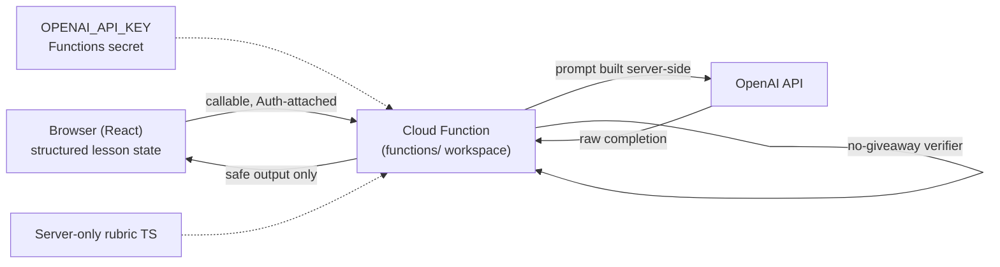
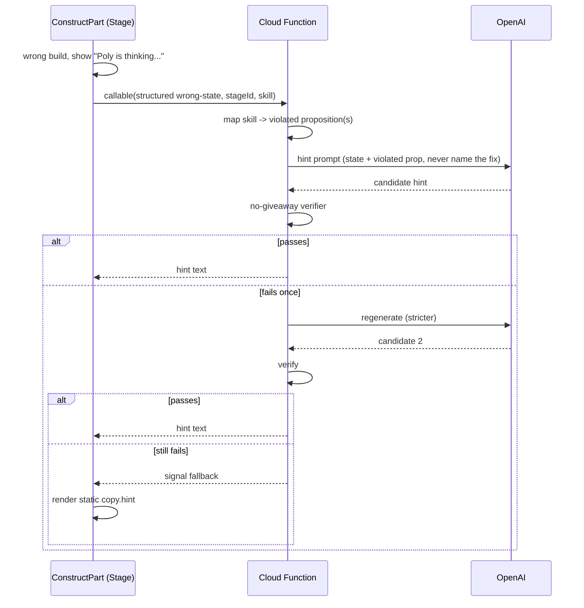
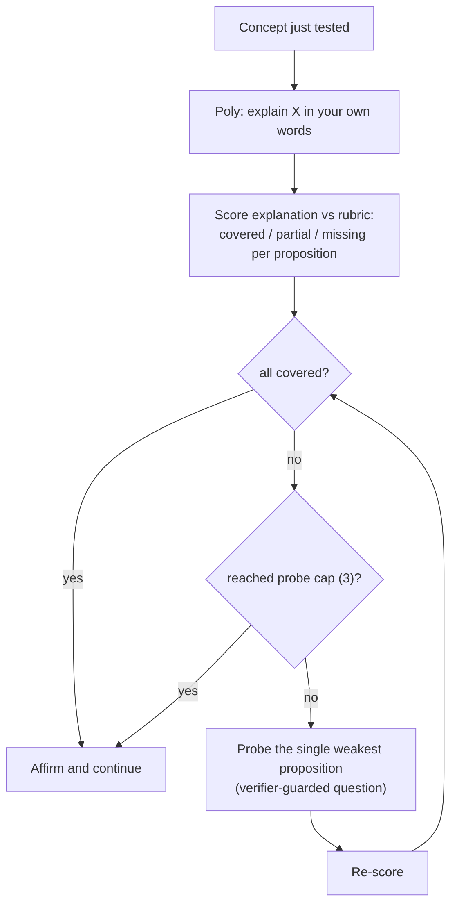

# Phase 2: AI Features Design (Poly hints + Poly checkpoints)

> Status: design agreed in the Jun 25, 2026 grilling, ready for an implementation plan.
> Scope: two AI features for Friday, both grounded in structured lesson state, both with
> automatic fallback. Personalization and spaced repetition are deferred to Phase 3.
> Companion to the working spec in `phase2-ai-features.md` (Downloads); this doc is the
> reconciled, codebase-aware version that resolves every `DECIDE:` from that draft.

## What we are building

Two independent AI systems that share one rubric spine. Both wear the "Poly" name but are
separate features whose only interplay is a deferred (Phase 3) personalization hook.

1. **Poly hints**: AI-generated hints for the hard, multi-step problems where a good static
   hint is impractical. In Stacks & Queues that is exactly the two **construct** beats
   (drag several cards to build a stack / build a queue). Easy beats (tap-one-card predict,
   classify, contrast) keep their existing static hints.
2. **Poly checkpoints**: a "learn by explaining" self-explanation loop at concept
   boundaries. The learner explains a concept in their own words; Poly scores the
   explanation against a rubric and probes the weakest gap a bounded number of times.

Friday target lesson: **Stacks & Queues** (lesson id `stacks-and-queues`).

## The determinism reconciliation (read this first)

The repo today asserts a blanket no-AI guarantee:

- `docs/architecture.md`: "deterministic, no-AI ... All grading is pure functions, no model
  calls."
- `docs/lesson-design.md` Principle 1 and Principle 4: assessment must be "deterministic
  from visible state or a hand-authored template, never a model call."

We are now going all-in on AI, so that blanket language is retired. But we deliberately
**keep the deterministic engine as the mastery spine**, because it is what makes the entire
test surface possible and it is the architecture's load-bearing asset. The reconciliation:

- **Mastery gating stays deterministic.** The engine (`gradeAnswer`, the 8-skill S&Q gate)
  still decides whether the learner passes. AI never decides correctness for progression.
- **AI is a first-class additive layer on top.** Hints and Poly checkpoints are advisory.
  Poly's covered/partial/missing scoring is explicitly **non-gating**: a side-quest, never a
  wall. The mastery gate does not read Poly's verdicts.

This is what "nothing contradictory" means in practice: the determinism doc language is
updated to describe deterministic grading as the *mastery* guarantee, not a ban on model
calls anywhere in the app. See "Docs to update".

## Runtime and security model

Stay on Firebase + Firestore. Add the project's first backend code as a Firebase
**Cloud Functions** workspace. The provider is **OpenAI (GPT)** via the user's API key, so
the Firebase AI Logic / Gemini SDK is not used for this path.

### The callable function is the only AI seam



Hard rules this enforces:

- **The GPT key never reaches the browser.** It lives as a Functions secret
  (`firebase functions:secrets:set OPENAI_API_KEY`). A key in a static Vite bundle is
  world-readable, so it must stay server-side.
- **The client only ever receives safe derived output**: generated hint text, or Poly's
  verdicts plus a rendered question. Never the rubric, never answer tokens, never raw
  prompts.
- **Auth comes free.** Callable functions receive the Firebase Auth context, so the
  existing sign-in model carries over with no new auth work.

## Shared infrastructure (built once, both features ride on it)

### 1. Concept rubric (server-only)

A handwritten, per-stage list of 2 to 4 key propositions the learner must convey or apply.
This is the answer key for Poly and the "what is missing" signal for hints.

- **Storage**: typed TS modules, **inside the `functions/` workspace only** (for example
  `functions/src/rubrics/stacksQueues.ts`). The rubric is the answer key, so it must not be
  bundled into the client. Anything imported into `src/` ships to the browser and is
  readable; the rubric therefore lives server-side and is read only by the function.
- **Shape** (from the working spec):

```ts
{
  stageId: "stacks-and-queues",
  propositions: [
    { id: "P1", text: "LIFO: last in, first out", answerTokens: ["LIFO", "last in first out"] },
    { id: "P2", text: "Only the top element is accessible", answerTokens: ["top"] },
    { id: "P3", text: "Order follows from the access rule", answerTokens: [/* must be authored, see below */] },
  ]
}
```

- **P3 must get real tokens.** The working draft left P3's `answerTokens` empty, which means
  the verifier can never catch P3 being given away. Authoring real tokens for every
  proposition (P3 included) is a required part of this slice.

### 2. Skill to proposition map (the "which idea" bridge)

The engine knows *what* is wrong (the wrong card, the wrong build order) but not *which
concept* the mistake offends. We hand-author a small map from each graded skill to the
proposition(s) it tests, so a wrong answer on a beat hands the AI the violated idea.

- Deterministic and predictable; reuses the existing `SQSkill` structure.
- For Friday, only the construct skills need entries (hints fire only there):
  `stackConstruct -> [P1, P3]`, `queueConstruct -> [P1, P3]` (exact mapping authored with
  the rubric).

### 3. No-giveaway verifier (word-scan)

Takes AI output plus the active rubric and rejects output that leaks an answer token for a
proposition the learner has not yet demonstrated.

- **Method**: case-insensitive substring match against authored `answerTokens`. Chosen over
  an LLM judge for Friday: cheapest, fully deterministic, no extra call. Known limitation:
  it misses reworded giveaways; that is accepted debt, mitigated by careful token authoring.
- **Regeneration policy**: on reject, regenerate **once** with a stricter prompt. If it
  fails again, fall back to the static hint (hints) or a generic affirm (Poly probes).
  **Never render an unverified giveaway.**

### 4. Structured-state reader

A function that serializes the learner's current problem state into a compact typed payload
for the prompt. The AI never sees raw screen text, only structured state. For Friday this
covers the S&Q construct beats (the `ConstructWork` loose/pushed arrays vs the target order)
and the checkpoint concept context.

## Feature 1: Poly hints (construct beats only)

### Trigger and scope

Fires only when the learner submits a wrong build on a **construct** beat (`stack-construct`,
`queue-construct`). All other beats keep their static `copy.hint`.

### Data flow



### Behavior rules

- **Input to the model**: structured wrong-state (what they did vs what the step required) +
  the violated proposition(s). Constraint: point at the mistake, never state the fix or name
  the proposition.
- **Latency feel**: a short "Poly is thinking..." indicator while the round-trip runs, then
  the hint appears.
- **Retry angle**: on a second wrong build, the prompt receives the new wrong-state plus the
  prior hint and is told to take a different angle (state, not a hardcoded rotation).
- **Cap**: 2 AI hints per problem, then fall back to the static hint.
- **Fallback (automatic, no toggle)**: on any failure (network, timeout, error, double
  verifier reject, or the cap), the learner silently gets the existing static `copy.hint`.
  There is no manual kill-switch for Friday; automatic fallback is the "works with AI off"
  guarantee.

### Draft prompt (hints)

```
SYSTEM:
You write one-line tutoring hints for a data-structures lesson. You are given the
learner's wrong action as structured state and the concept proposition they violated.
Point them toward their specific mistake. NEVER state the correct answer or name the
proposition directly. No more than two sentences. No analogies unless asked.

USER:
Stage: {stageId}
Required step: {required}
Learner did: {wrongState}
Violated proposition: {prop.text}
Write the hint.
```

## Feature 2: Poly checkpoints (self-explanation)

### Placement

Two checkpoints in the S&Q lesson: one right after the stacks section, one right after the
queues section. The lesson run order is stacks beats, then queues beats, then compare; the
checkpoints sit at those two concept boundaries.

### The loop



### Behavior rules

- **Three-way scoring, never binary**: each proposition is covered / partial / missing. A
  correct idea in non-canonical words (an analogy, an example) is covered, never punished.
- **Bounded**: cap probes at **3** exchanges, then affirm and continue regardless. Poly is a
  side-quest, never a gate; it does not affect mastery.
- **Verifier guard on probes**: the probe question must not contain the missing
  proposition's answer tokens. Same word-scan, same regenerate-once-then-fallback policy
  (fallback here is a generic affirm).
- **Fallback (AI off)**: if the checkpoint cannot run (any failure), skip it and proceed to
  the next concept. The lesson still completes.

### Voice

Voice is the Friday goal, built on a working text loop first. Text loop ships first; voice
is a modality wrapper added on top: TTS out + STT in. **OpenAI provides both TTS and STT**,
so the whole feature stays on one provider and one key. The voice transcript feeds the same
scorer as typed text.

### What Poly stores

Store the **raw explanation text** for Friday. This is acceptable because the Friday
audience is a demo (no real students, no minors), so there is no COPPA/FERPA/GDPR exposure
on demo data. This is revisited before any real-student use (see "Deferred").

### Draft prompts (scorer and prober)

```
SYSTEM (scorer):
You evaluate a learner's free-text explanation of a concept against a rubric of
propositions. For each proposition return covered | partial | missing. A proposition is
covered if the learner conveys the idea in ANY wording, including analogies or examples.
Do not require exact terminology. Return ONLY JSON: {scores:[{id, verdict}], weakest:id}.
Never include the rubric text in any field.

USER:
Concept: {conceptName}
Rubric: {propositions}
Learner explanation: {explanation}
```

```
SYSTEM (prober):
You ask ONE short follow-up question to help a learner surface a missing idea. You are
given the proposition they have not yet conveyed. Ask a question that leads them toward
it. NEVER state the idea. NEVER include its key terms. One sentence.

USER:
Concept: {conceptName}
Missing proposition: {prop.text}
Their last explanation: {explanation}
```

## Build order and Git workflow

Five chunks, a dependency chain (not parallel). Each chunk is developed in its own **git
worktree** on its own branch, lands as one **focused PR**, and is merged in order into an
always-green `main`. Rationale: the chunks are sequential, so worktrees buy isolation (a
clean, always-runnable `main`) rather than parallelism, which directly supports the
"app always works, AI or not" guarantee. Per-chunk PRs give a reviewable history and let the
review/CI loop run on each piece.

1. **Backend seam**: `functions/` workspace + a callable function skeleton + the key as a
   Functions secret. A verified round-trip, no AI logic yet.
2. **Shared infra**: server-only rubric (S&Q, with P3 tokens authored), the skill to
   proposition map, and the no-giveaway word-scan verifier.
3. **Feature 1**: Poly hints on the two construct beats (prompt to verifier to render,
   "thinking" indicator, static fallback, 2-hint cap).
4. **Feature 2**: Poly checkpoints, text loop only (scorer + prober, 3-probe cap, two
   checkpoints, skip-on-failure fallback).
5. **Voice layer**: TTS out + STT in on Poly via OpenAI. This is the cut line if Friday gets
   tight; do not let it consume the days the text loop needs.

## Docs to update

These updates are part of this work, so the repo stops asserting a stale guarantee:

- `docs/architecture.md` (lines ~9-12): replace "deterministic, no-AI ... no model calls"
  with the reconciled framing: deterministic grading is the **mastery spine**; AI is a
  first-class additive advisory layer (hints, Poly) that never gates mastery. Add the
  `functions/` workspace and the callable-function AI seam to the architecture map.
- `docs/lesson-design.md` (Principles 1 and 4): clarify that the no-model-call rule binds
  **mastery-gating assessment**, not advisory AI surfaces. Note that Poly scoring is
  non-gating by design.

## Out of scope (deferred to Phase 3)

- **Personalization / student model**: the only cross-feature link. Once Poly learns a
  learner's rhetorical mode (analogy / mechanical / example-driven) from checkpoints, hints
  could later adopt that style. Not built for Friday; not even logged toward it beyond the
  stored raw text already noted.
- **Spaced-repetition engine**: scheduling, retrieval targeting, mastery tracking. All
  deterministic, a separate subsystem. The AI features can ride on it later but do not
  require it.
- **Verifier debt**: replacing hardcoded-for-determinism problems with real engines (SymPy,
  graph isomorphism). A verifier ticket, not an AI ticket.
- **Privacy hardening**: real-student use requires revisiting raw-explanation storage
  (consent, retention, anonymization) before any non-demo audience.

## Test contract

Honors the repo's three-seam contract (`docs/lesson-design.md`):

- **Function unit tests**: the verifier (token match incl. P3, reject + regenerate path),
  the skill to proposition map, the structured-state reader. Pure logic, the primary
  surface.
- **Engine / integration**: the construct beats still grade deterministically with the AI
  layer absent (fallback path), proving "works with AI off".
- **E2E tracer**: extend the existing S&Q tracer to cover a construct wrong-build showing a
  hint (with the function stubbed/mocked) and a checkpoint running its text loop, plus the
  fallback path when the function is unavailable.

## Resolved decisions (from the working spec's `DECIDE:` list)

| Decision | Resolution |
|---|---|
| AI vs determinism contradiction | AI is first-class; mastery gating stays deterministic and non-AI. Docs updated. |
| Runtime / provider | OpenAI (GPT key), called via a Firebase callable Cloud Function. |
| Key security | Functions secret, server-side only; client never sees the key. |
| Rubric storage | Typed TS, server-only in `functions/`; client gets only derived output. |
| Verifier strength | Word-scan with authored tokens for every proposition (P3 included). |
| Regeneration policy | Regenerate once stricter, then static fallback. |
| Which proposition a wrong answer violates | Hand-authored skill to proposition map. |
| Hint scope (S&Q) | Construct beats only; static hints elsewhere. |
| Hint cap | 2 AI hints per problem, then static. |
| Hint latency UX | "Poly is thinking..." indicator. |
| AI off behavior | Automatic fallback on failure; no manual kill-switch for Friday. |
| Poly placement | Two checkpoints: after stacks, after queues. |
| Poly probe cap | 3 exchanges, then affirm and continue. |
| Poly scoring | Three-way covered / partial / missing; non-gating. |
| Voice | Goal for Friday, text loop first; OpenAI TTS + STT, same scorer. |
| Poly storage | Store raw explanations (demo audience, no minors). |
| Git workflow | Worktree + focused PR per chunk, merged in order into green `main`. |
