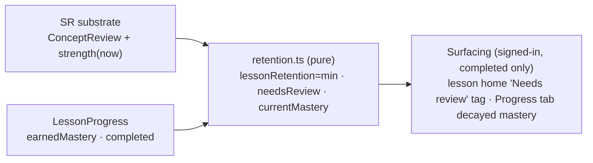

# Spiky-POV deprogression: design (inactivity = decay)

> Status: design agreed in the Jun 25, 2026 brainstorming (Decisions 1-4 plus the
> retrieval-chat alignment), ready for an implementation plan.
> Scope: the read-side decay feature only. It consumes the spaced-repetition chat's
> per-concept memory substrate and derives a per-lesson "retention + needs-review"
> view. It persists nothing new. The mastery tree, the retrieval drill UI, anonymous
> decay, and hard relocking are out of scope.
> Companions: `docs/notes.md` (Spiky POV + Learning/Space Repetition Engine), and the
> sibling `2026-06-25-spaced-repetition-retrieval-design.md` (the substrate owner).

## What we are building

A learner who stops practicing should watch mastery fade. That is the spiky-POV answer
to engagement-streak learning (Duolingo): pull back from "don't break the streak" and
target true retention, surfacing memory decay so a learner returns before the
catastrophic drop. We model decay with the Ebbinghaus forgetting curve and the spacing
effect (Cepeda 2008), and we surface it softly.

Decisions locked in the grilling:

1. **Soft deprogression.** Decay lowers a lesson's *shown* mastery and flags it
   "needs review" past a threshold. Completion and unlocks are preserved; recovery is
   by practicing again. Decay never un-completes or relocks a lesson.
2. **Per lesson (derived).** We surface one retention signal per lesson. The underlying
   state is per-concept and owned by the substrate; "per lesson" is an aggregation.
3. **Spaced reinforcement.** Strength grows with well-timed returns and flattens the
   next forgetting curve. This is exactly the substrate's derived `strength()`, whose
   half-life rises with the ladder level.
4. **Weakest link (min).** A lesson's retention is the minimum strength across its
   load-bearing concepts: one rotted core skill flags the lesson and never hides behind
   fresher concepts.

## Determinism

Deprogression is engine-layer pure: every value is a function of substrate state plus an
injectable `now`, with no model calls and no clocks in logic (mirrors
`computeProgressMetrics(now?)`). This holds even as Phase 2 adds AI elsewhere; decay is
not an assessment surface, so the "deterministic grading is the mastery spine" framing is
untouched.

## Alignment with the retrieval substrate (read first)

The memory-over-time state is owned by the spaced-repetition chat, not here. We treat its
per-concept `ConceptReview` and derived `strength()` as the single source of truth and
derive everything on top. We add no `lastPracticedAt`/`strength` to `LessonProgress`, so
the two features never keep parallel memory models or write the same Firestore rows.

The contract we depend on (imported, never redefined here):

```ts
// owned by the substrate; we only read these
interface ConceptReview {
  conceptId: string
  level: number
  correctStreak: number
  lapses: number
  lastSeenAt: number
  dueAt: number
  graduated: boolean
}

// 0..1 retrievability, derived-on-read (forgetting curve; half-life from level)
function strength(review: ConceptReview, now: number): number

// concept taxonomy; `retrievable` marks the load-bearing sub-skills
function conceptsForLesson(lessonId: string): { id: string; retrievable: boolean }[]
```

Two coordination points captured for the plan:

- **Module location.** The substrate must live in a neutral module (proposed
  `src/features/progress/conceptReview.ts`) so deprogression does not import from
  `src/features/retrieval/`. Deprogression depends on the substrate, not on retrieval.
- **Recovery hook.** Normal in-lesson correct answers (not only scheduled retrieval
  drills) must update a concept's review via the substrate's `applyReview`, so
  re-practicing a rusty lesson actually heals it. Ownership of that call is being
  coordinated with the retrieval chat (the one cross-cutting hook); deprogression only
  reads the result.

## Data model (all derived; new file `src/features/progress/retention.ts`)

No persistence is added. The feature is three pure selectors plus tunable constants.

```ts
export const REVIEW_THRESHOLD = 0.5 // below this, a completed lesson reads "needs review"
export const BANDS = { fresh: 0.8, fading: 0.5, rusty: 0.2 } as const

/**
 * Weakest-link retention for a lesson: the minimum strength across its load-bearing
 * concepts. `null` means the lesson has no load-bearing concepts to track. A
 * load-bearing concept with no review row yet falls back to 1 (treat as freshly
 * earned), so a not-started lesson reads fresh and we never flag on missing data.
 */
export function lessonRetention(
  lessonId: string,
  reviews: ReadonlyMap<string, ConceptReview>,
  now: number,
): number | null {
  const concepts = conceptsForLesson(lessonId).filter((c) => c.retrievable)
  if (concepts.length === 0) return null
  const strengths = concepts.map((c) => {
    const r = reviews.get(c.id)
    return r ? strength(r, now) : 1
  })
  return Math.min(...strengths)
}

export function needsReview(retention: number | null): boolean {
  return retention !== null && retention < REVIEW_THRESHOLD
}

/**
 * The shown mastery, decayed. `earnedMastery` is today's peak record
 * (`analytics.lessonStats.mastery`, correct/total) and is left untouched; we multiply
 * by retention for display so the earned record stays honest while the surface fades.
 */
export function currentMastery(
  earnedMastery: number,
  retention: number | null,
): number {
  return retention === null ? earnedMastery : earnedMastery * retention
}
```

Edge cases:

- **Not-started / in-progress lessons.** Their concepts have no review rows (the
  substrate seeds a row on first demonstrated-correct), so retention is fresh and
  surfacing is additionally gated to completed lessons (below). Only completed lessons
  can read "rusty".
- **Partial review coverage on a completed lesson.** Missing rows fall back to strength
  1, so `min` is taken over the concepts we actually have: conservative, never a false
  flag.

## Where it surfaces (v1, minimal)

Honors the `notes.md` rule that progress data is not scattered: only the Progress tab and
lesson home carry it. Signed-in only, and only for completed lessons.



- **Lesson home / course node:** a small "Needs review" tag when a completed lesson's
  retention is below the rusty band. This is the non-tree placeholder; the spiky mastery
  tree is deferred.
- **Progress tab:** per-lesson mastery renders `currentMastery` (decayed), and overall
  mastery is the aggregate of per-lesson `currentMastery`; the "Last practiced" read is
  driven by the substrate, not a new field.
- **Everywhere else** (wide-screen home dashboard, lesson tabs): unchanged.

## Recovery

Practicing heals a lesson: the substrate's `applyReview` resets the concept clock and
raises its level, so `strength()` climbs and retention rises back above the threshold.
Deprogression owns none of that write path; it re-derives on the next read.

## Build order and Git workflow

Developed in a **git worktree** on its own branch, landing as a **focused PR** merged into
an always-green `main` (matching the house workflow). It depends on the substrate, so:

1. **Pure selectors + unit tests.** Build `retention.ts` against the agreed substrate
   interface using in-memory `ConceptReview` fixtures. Unblocked even before the substrate
   merges.
2. **Provider wiring.** Read the per-user reviews through `CourseProgressProvider` (the
   substrate exposes them) and expose `lessonRetention` / `needsReview` / `currentMastery`
   to surfaces. Lands after the substrate is in `main`.
3. **Surfacing.** The "Needs review" tag on lesson home + decayed mastery on the Progress
   tab.

## Out of scope / deferred

- **Mastery tree visuals** (the spiky tree). This feature only emits the per-lesson
  retention the tree will later read.
- **Retrieval drill UI / scheduling.** Owned by the spaced-repetition chat; it is the
  recovery mechanism, not part of this slice.
- **Anonymous decay.** Signed-in only, matching retrieval (anonymous runs are transient).
- **Hard relocking.** We stay soft (Decision 1).
- **Displayed-number softening.** Optionally show the mean while triggering "needs review"
  on the min; a post-hoc tweak that does not touch the data model.

## Test contract

Honors the three-seam contract (`docs/lesson-design.md`):

- **Unit (primary):** `lessonRetention` (min aggregation, null-when-not-started,
  missing-review fallback to 1), `needsReview` threshold, `currentMastery` decay, band
  edges. Pure, no React.
- **Integration:** reviews flow substrate -> repository -> provider -> selector, once the
  substrate exists.
- **E2E tracer:** a completed lesson shows "Needs review" after simulated inactivity
  (`now + N days`) and clears after re-practice. Deferred until the surfacing lands.

## Resolved decisions

| Decision | Resolution |
|---|---|
| How much decay changes progress | Soft: lowers shown mastery + "needs review"; never un-completes or relocks. |
| Unit that decays | Per lesson, derived (underlying state is per-concept, owned by the substrate). |
| How strength is earned | Spaced reinforcement: strength grows with well-timed returns (Cepeda 2008). |
| Per-lesson aggregation | Weakest link (min) across load-bearing concepts. |
| Memory ownership | Consume the substrate's `ConceptReview` + derived `strength`; persist nothing new. |
| Substrate location | Neutral module (`src/features/progress/conceptReview.ts`), so no deprogression -> retrieval import. |
| Recovery | Substrate `applyReview` on normal in-lesson correct answers; we re-derive on read. |
| Shown vs earned mastery | Keep `earnedMastery` (peak); display `currentMastery = earned * retention`. |
| Needs-review threshold | retention < 0.5 (rusty band); tunable. |
| Identity | Signed-in only, matching retrieval. |
| Surfacing | Progress tab + lesson home only; completed lessons only; tree deferred. |
| Git workflow | Worktree + focused PR, merged in order into green `main`. |
