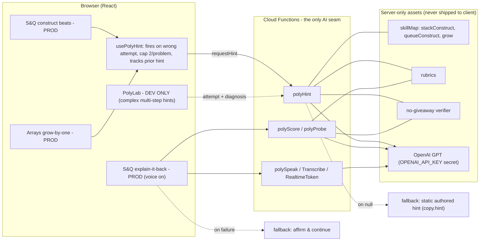
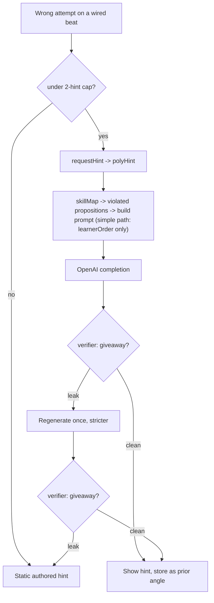
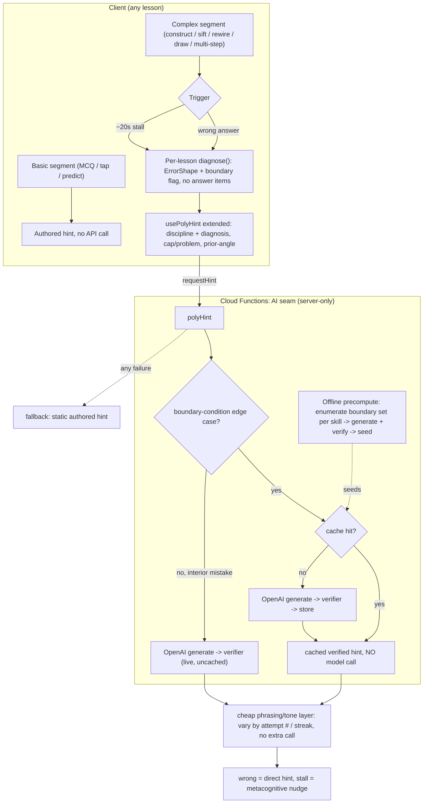
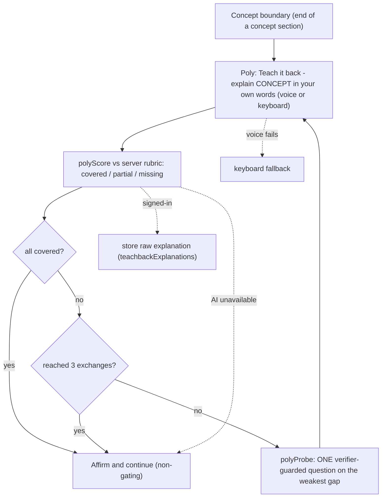

# Poly AI Help: Hint Architecture + Teach-back (Design)

> Status: design agreed in the Jun 28, 2026 session, ready for an implementation plan.
> Scope: finalize the two learner-facing AI surfaces and where AI runs across the app.
> 1. The **hint architecture** (where AI is used for hints, current and future vision).
> 2. The **Teach-back** feature (formerly "Poly checkpoints" / the explain-it-back loop),
>    including its official name.
>
> This doc reconciles and **un-defers** `2026-06-27-poly-hint-tiers-design.md` (it resolves
> that spec's one open question) and builds on `2026-06-25-phase2-ai-features-design.md`.
> Provider stays OpenAI via Firebase callable Cloud Functions; Firebase AI Logic / Gemini is
> not used for this path.

## What we are finalizing

Two agenda items, one shared AI seam:

1. **Hint architecture.** Lock where AI generates hints, the tier split, the triggers, how
   personalized a hint is (which sets cacheability and cost), and how the cache is filled.
2. **Teach-back.** Lock the self-explanation loop's behavior, give it an official name that
   is not "checkpoint", and set the rule for rolling it across lessons.

## Current state (where AI is used today)

Two AI features ride on one seam (the callable Cloud Functions layer). Both wear the "Poly"
name. Provider is OpenAI/GPT.

Current hint request lifecycle (what actually runs on a wrong answer today):

Key facts that frame the work:

- **Prod hints only use the "simple" path** (the learner's order plus the violated
  propositions). The richer **complex path** (`src/features/poly/diagnose.ts` producing a
  structural `attempt` + `diagnosis`) is fully built on client and server but only wired into
  `PolyLab`, which is dev-only (`import.meta.env.DEV`). So the future vision is largely
  un-deferring the tiered-hints spec.
- **Coverage is tiny:** only 3 skills are mapped (`stackConstruct`, `queueConstruct`,
  `grow`), across 2 lessons (S&Q, Arrays). There is no cache and no stall nudge.
- **"checkpoint" is overloaded** across three unrelated features: the explain-it-back loop
  (this doc renames it), the retrieval / spaced-repetition system
  (`src/features/retrieval/checkpoint.ts`), and the trials reinforce step
  (`src/features/trials/reinforceCheckpoint.ts`). Renaming the explain-it-back loop is also a
  disambiguation.
- **No feature flags.** The only gating is `import.meta.env.DEV` (PolyLab) and a runtime soft
  fallback when functions / OpenAI are unavailable.

## Decisions locked in this session

| Area | Decision |
|---|---|
| Hint direction | Un-defer the tiered-hints direction; finalize it as the production architecture. |
| Tier split | Basic segments (single MCQ / tap / predict) keep authored hints, no API call. Complex segments (construct, sift, rewire, draw, multi-step) send every mistake to AI; a hand-authored hint is never shown for a complex segment except as the failure fallback. |
| Triggers | Complex segments: wrong answer to a direct hint; ~20s stall to a metacognitive "thinking nudge". |
| Diagnosis layer | Each complex mechanic gets a pure, giveaway-free `diagnose()` emitting a structural `ErrorShape` (error-kind + step + wrong config, never answer items). |
| Personalization | Personalize **to the mistake**: cache key is the structural diagnosis hash. A cheap no-extra-call phrasing/tone layer varies wording by attempt # / streak. Per-learner style stays deferred. |
| Cache scope | Caching is enabled **only for complex-problem edge cases (problem boundary conditions** like empty / single element / at-capacity / overflow / first-last position). Interior (non-boundary) complex mistakes go to live AI, uncached. |
| Cache fill | The boundary set is finite and enumerable per mechanic: precompute + verify it offline (instant, vetted), and lazy-fill any boundary shape missed. |
| Provider | OpenAI (GPT), via Firebase callable Cloud Functions. Not Gemini. |
| Verifier | No-giveaway word-scan always runs before anything is cached or shown; regenerate once stricter, then static fallback. |
| Hint fallback | Any failure (network, miss + generate failure, verifier double-reject, cap) falls back to the static authored hint. |
| Teach-back name | UI label "Teach-back" (replaces "Quick check"); code stem `teachback` (replaces `checkpoint` for this feature only). |
| Teach-back behavior | 3-exchange cap, non-gating, voice on by default (fails soft to keyboard), store raw explanation for signed-in users only. |
| Rename scope | Only the explain-it-back feature. The retrieval and trials "checkpoint" systems are not touched. |

## Section A: Hint architecture (future vision)

### How it works

- **Tier gate (client).** Each segment declares its tier. Basic segments render their
  authored `hint` copy with no call. Complex segments send every wrong answer / stall to the
  AI path; a hand-authored hint is never shown for a complex segment except as the failure
  fallback.
- **Deterministic diagnosis (client, pure).** On a wrong answer or a stall, the segment's
  `diagnose()` runs against the unique correct line and returns a concept-agnostic
  `ErrorShape` (kind + 1-based step + the wrong configuration) plus a **boundary flag**
  marking degenerate / limit configurations (empty, single element, at-capacity, overflow,
  first / last position), naming no answer items. This generalizes `diagnose.ts`. Grading
  stays pure; only phrasing is AI.
- **Edge-case cache (server).** Caching is enabled **only for boundary-condition edge
  cases**. When the diagnosis is a boundary case, `polyHint` hashes it into a cache key and
  looks it up first (hit returns the cached, already-verified hint with no model call; miss
  generates with OpenAI, verifies, stores, returns). When the diagnosis is an interior
  (non-boundary) mistake, `polyHint` generates live and does not read or write the cache. The
  stall "thinking nudge" follows the same rule.
- **Why this scope.** Boundary conditions are a finite, enumerable, high-recurrence set
  (everyone hits empty / single / full), so caching + precomputing them pays off and yields
  vetted, instant hints. Interior mistakes are the varied long tail, where a live call gives
  freshness and a cache would rarely hit. Cost note: interior complex mistakes are a live call
  each, so they cost more than the boundary path.
- **Phrasing/tone layer.** A cheap, no-extra-call transform varies wording by attempt number
  or streak so repeats do not feel identical, applied to both cached and live hints.
- **Fallback.** Any failure path lands on the static authored hint, preserving the
  "works with AI off" guarantee.

### Per-lesson work (per complex mechanic)

- A pure `diagnose()` for the mechanic (the conditioning context, the cache key, and the
  boundary-condition flag that decides whether a result is cached).
- `skillMap` + `rubrics` + verifier tokens extended to the new concepts.
- The hint prompt's structured-state branch for the new discipline.
- The `discipline` union extended for the new lesson.

### Soft defaults (open to change in spec review)

- **Stall threshold:** 20s.
- **Hint cap:** 2 distinct AI hints per problem, then static; stall nudges counted
  separately.
- **Cache store:** a server-only Firestore collection keyed by the diagnosis hash, holding
  **boundary-condition hints only**, seeded by an offline precompute of each skill's boundary
  set and lazy-filled on a boundary miss. Server-only so the rubric / answer surface never
  ships to the client.
- **Rollout order:** pilot Linked Lists (rewire and orphan-the-tail are rich diagnosis
  targets), then retrofit S&Q construct + Arrays grow into this pipeline as the reference
  implementations, then Hash Tables, Trees, Heaps, Graphs. Intro has no complex segments, so
  no hints there.

## Section B: Teach-back (finalize + rename)

"Teach-back" is the renamed explain-it-back / self-explanation loop. You teach the concept
back to Poly; the act of teaching is what cements it (the protege effect). The loop is the
one already shipping in Stacks & Queues; this section formalizes and renames it.

### Locked behavior (unchanged from today)

- Ask, score against a server rubric (covered / partial / missing per proposition), probe the
  single weakest gap, capped at 3 exchanges, then affirm and continue.
- Non-gating: the deterministic engine still owns progression; Teach-back never blocks
  mastery.
- Voice on by default, fails soft to keyboard.
- Stores the raw explanation for signed-in users only (anonymous play skips storage). This is
  the substrate that could later feed Phase-3 hint personalization (the deferred
  rhetorical-mode bridge).

### Rename scope (precise)

Renamed (this feature only):

- `src/lessons/stacksQueues/PolyCheckpoint.tsx` to a `Teachback` component (and its test
  `PolyCheckpoint.test.tsx`).
- The `CHECKPOINTS` / `CHECKPOINT_VOICE` constants and the insertion logic in
  `src/lessons/stacksQueues/Stage.tsx`, plus `Stage.checkpoint.test.tsx`.
- The UI label "Quick check" to "Teach-back".
- The Firestore collection `checkpointExplanations` to `teachbackExplanations`
  (`src/features/poly/explanationStore.ts`, `firestore.rules`, and the emulator test).
- The PolyLab panel and the `video/` mock (`CheckpointWeb.tsx`) plus doc references.

Explicitly NOT touched (different systems that keep the "checkpoint" word):

- `src/features/retrieval/checkpoint.ts` (spaced-repetition retrieval).
- `src/features/trials/reinforceCheckpoint.ts` (trials reinforce step).

### Soft defaults (open to change in spec review)

- **Prompt copy** shifts to the teach framing, for example: "Teach it back: explain
  `{concept}` in your own words."
- **Firestore collection:** new `teachbackExplanations`; old `checkpointExplanations` demo
  docs are abandoned (no migration, since it is demo data).
- **Coverage / rollout:** one Teach-back per concept boundary, with an authored rubric per
  concept. Keep S&Q live; add Teach-back to each new lesson as its rubric is authored,
  following the same lesson cadence as hints (Linked Lists next).

## Sequencing / rollout

The two surfaces share infra but are largely independent to implement, so they will likely
split into separate implementation plans:

1. **Hint architecture pipeline** (AI seam, diagnosis hashing + boundary flag, boundary-set
   precompute, edge-case cache, live path for interior mistakes, phrasing layer, stall nudge)
   built against the Linked Lists pilot, then S&Q + Arrays retrofit, then the remaining
   lessons.
2. **Teach-back finalize + rename** (scoped rename, prompt copy, collection switch, placement
   rule), then per-lesson rubric authoring as Teach-back rolls out.

Both stay behind the existing soft-fallback guarantee: the app works with AI off.

## Deferred (Phase 3)

- **Per-learner hint personalization** (rhetorical mode learned from Teach-back, mastery
  state). Teach-back already stores the raw explanations that would feed this.
- **Spaced-repetition / retrieval engine** integration. Separate, deterministic subsystem.
- **Privacy hardening** for real-student use (consent, retention, anonymization of stored
  explanations) before any non-demo audience.

## Test contract

Honors the repo's seam contract:

- **Function unit tests:** the boundary-vs-interior routing, the boundary cache lookup/store
  path, the boundary cache-miss generate-verify-store path, the interior live (uncached) path,
  the extended verifier / skillMap / rubric per new concept, and the stall-nudge branch.
- **Pure unit tests:** each new per-lesson `diagnose()` (the deterministic surface), and the
  phrasing/tone transform.
- **Engine / integration:** complex segments still grade deterministically with AI absent
  (fallback path), proving "works with AI off".
- **Component:** the renamed `Teachback` component (keyboard + voice), and its insertion at
  concept boundaries.
- **E2E tracer:** a complex wrong-build showing a cached hint (function mocked), a Teach-back
  loop, and the fallback paths when the function is unavailable.

## Docs to update

- `docs/plans/specs/2026-06-27-poly-hint-tiers-design.md`: mark un-deferred; point to this
  doc as the finalized architecture; note the open personalization question is resolved
  (personalize to the mistake, per-learner deferred).
- `docs/architecture.md`: add the hint AI seam and the boundary-condition edge-case cache;
  rename "Poly checkpoints" to "Teach-back".
- Worked-example docs that mention "Quick check" / "checkpoint" for the explain-it-back loop.

## Open items for spec review

- Confirm the soft defaults in Sections A and B (stall threshold, hint cap, cache store,
  rollout order, prompt copy, collection handling, Teach-back coverage).
- Confirm whether the hint architecture and Teach-back should be one implementation plan or
  two.
